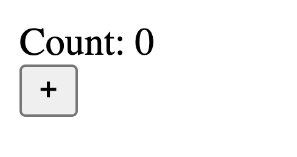

# Introduction


Building modern CFML apps is complicated. [ColdBox](https://coldbox.ortusbooks.com) makes creating server-side apps easy, but what about the client-side? Front-end JavaScript frameworks like Vue and React are powerful, yet they also introduce complexity and a significant learning curve when creating our apps.

What if you could create apps that look and feel like your Vue and React web apps but are written with CFML. Impossible, you say? Nay, we say!

Introducing **cbwire: Power-up your CFML! **

## Let's create a Counter in cbwire...

Install [CommandBox](https://www.ortussolutions.com/products/commandbox), then from your terminal, run:

```bash
mkdir cbwire-demo
cd cbwire-demo
box create app .
box install cbwire
box server start
```

Let's add cbwire styling and script references to our layout using `wireStyles()` and `wireScripts()`, and include a cbwire component we will create using `wire( "Counter ")`.

```markup
<-- ./layouts/Main.cfm -->
<cfoutput>
<!doctype html>
<html lang="en">
<head>
    #wireStyles()#
</head>
<body>
    #wire( "Counter" )#
    #wireScripts()#
</body>
</html>
</cfoutput>

```

Let's create our _Counter_ cbwire component.

```javascript
// File: ./wires/Counter.cfc

component extends="cbwire.models.Component" {

    // Reactive Data Properties
    variables.data = {
        "counter": "0"
    };

    // Action to increment counter
    function increment(){
        variables.data.counter += 1;
    }

    // Tell cbwire where our Counter template is
    function renderIt(){
        return this.renderView(
            "wires/counter"
        );
    }

}

```

```markup
<!-- ./views/wires/counter.cfm -->
<cfoutput>
<div>
    <div>Count: #args.counter#</div>
    <button wire:click="increment">
        +
    </button>
</div>
</cfoutput>
```

Now that you've created your _Counter_ component, you can include this component in any layout or view throughout your app using the `wire()` helper method.

Refresh the page, and you find a reactive Counter that increments when you hit the plus button.



## How is this working!!!?

1. cbwire renders our _Counter_ component with our `.cfm `page.  ( View Source to see this ). This means cbwire is SEO-friendly.
2. When a user clicks the plus button, cbwire makes an AJAX request to the server and triggers the _increment_ action.
3. cbwire updates the counter state
4. cbwire re-renders the component template and returns the updated HTML in the AJAX response
5. cbwire is using the amazing [Livewire](https://laravel-livewire.com) JavaScript library to mutate the DOM based on our state changes.

* We built a reactive counter.
* We're not refreshing the page.
* We didn't write any JavaScript.
* We didn't have to worry about webpack configuration or compilation.&#x20;
* We never left CFML.:nerd:&#x20;

## Fantastic, right?

We're just getting warmed up! cbwire has transformed the way we are building apps, and we think you're going to love it also.&#x20;

## Credits

cbwire wouldn't even exist if it wasn't for the impressive efforts of Caleb Porzio ( creator of [Livewire](https://laravel-livewire.com), also [Alpine.js](https://github.com/alpinejs/alpine) ) and the PHP Laravel community. Caleb created Livewire for use with the PHP framework Laravel. cbwire is a port of the Livewire functionality to ColdBox and CFML, with some additional goodies sprinkled in.

The cbwire module for ColdBox is written and maintained by [Grant Copley](https://twitter.com/grantcopley), [Luis Majano](https://twitter.com/lmajano), and [Ortus Solutions](https://www.ortussolutions.com).

## Project Support

If cbwire makes you:heart\_eyes:, please consider becoming one of our lovingly esteemed [Patreon supporters](https://www.patreon.com/ortussolutions).
